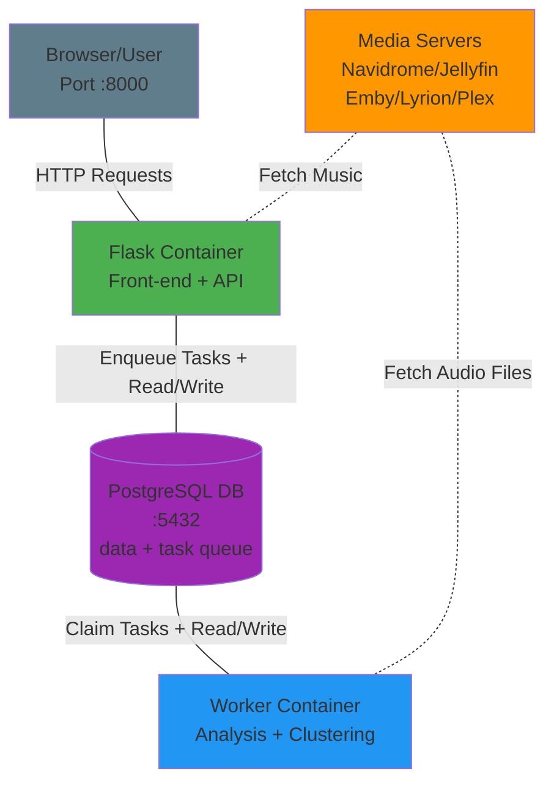

# Architecture

AudioMuse-AI follows a distributed architecture with separate containers for web interface, task processing, and data storage.

The easiest choice is to deploy everything on a single machine. For better performance you can also deploy several workers on several machines, to speed up batch tasks like analysis and clustering. Those extra workers can be shut down when the batch tasks are done.

For the algorithms running inside these components, see [ALGORITHM](ALGORITHM.md). For the multi-server model, see [MULTI_SERVER](MULTI_SERVER.md).

## System Architecture

## Component Responsibilities

### Flask Container
- **Web Interface**: Serves the front-end UI accessible at port 8000
- **REST API**: Provides endpoints for all AudioMuse-AI features
- **Task Orchestration**: Enqueues analysis, clustering, cleaning and sweep jobs as rows in the PostgreSQL `task_status` table
- **Similarity Queries**: Loads the similarity indexes and answers similar song, path, alchemy, map and search requests
- **Data Access**: Reads track information, playlists, and results from PostgreSQL
- **Media Server Integration**: Creates playlists on the media servers

### Worker Container
- **Job Processing**: Claims tasks from the PostgreSQL queue with `FOR UPDATE SKIP LOCKED`
- **Audio Analysis**: Performs sonic analysis using Librosa and ONNX models (MusiCNN, DCLAP, Whisper, Silero, GTE)
- **Clustering**: Executes playlist generation algorithms (KMeans, DBSCAN, GMM, Spectral)
- **Index Building**: Rebuilds the similarity indexes and the 2D projections, then publishes a reload message
- **Data Persistence**: Writes analysis results and embeddings to PostgreSQL
- **Audio Fetching**: Downloads audio files from media server for processing

### Task Queue (`taskqueue/`)
There is no broker. The queue is the `task_status` table plus Postgres `LISTEN`/`NOTIFY`, which
removes the two-sources-of-truth problem that a separate broker created: a job's row IS its
queue entry, so "queued" and "recorded" cannot disagree.

- **Task Queue**: A `NEW` row is a pending job; a worker claims it with `FOR UPDATE SKIP LOCKED`
- **Job Status**: One column, five values - `NEW`, `RUNNING`, `SUCCESS`, `FAIL`, `REVOKED`
- **High Priority Queue**: A `queue_name` of `high` for coordinator tasks, so a flood of child jobs cannot starve them
- **Liveness**: A session advisory lock held by the running worker; a dead process releases it instantly, with no heartbeat and no lease
- **Restarts**: A task restarts only because its worker died, at most `QUEUE_MAX_ATTEMPTS` (3) times, then fails for good
- **Wedged main tasks**: A worker that is alive but stopped progressing still holds its lock, so reclaim cannot take it and the one-live-main rule locks out every other main task. After `QUEUE_WEDGED_MAIN_TASK_MINUTES` (180) with no change to its row, maintenance cancels it, which ends that worker; the task is then reclaimed and resumes from its persisted progress, or on its last attempt fails, which still frees the queue. The cancel is a NOTIFY the worker's listener thread must act on, so a row still silent at twice the limit has plainly ignored it and has its Postgres backends terminated instead - that releases the advisory lock reclaim needs whether the worker can hear anything or not. A phase that is one long opaque call (the nine index builds) keeps its row fresh with a heartbeat so it is not mistaken for a wedge. It stands down while a control-plane action is in flight
- **Wake-up and cancel**: `NOTIFY` on `audiomuse_job` / `audiomuse_cancel`, delivered to every worker in every container
- **Events**: `NOTIFY audiomuse_event 'index-reload'` tells the Flask process to reload the similarity indexes

### PostgreSQL Database
- **Track Metadata**: Stores song information, paths, and library data
- **Analysis Results**: Mood scores, embeddings, feature vectors, lyrics and CLAP embeddings
- **Server Mapping**: The `music_servers` registry plus the per-server track and artist mapping tables
- **Playlists**: Generated clusters and user playlists
- **Similarity Indexes**: The disk-paged IVF indexes used for vector similarity search

### Media Server
- **Music Source**: Provides access to audio library
- **API Integration**: Navidrome, Jellyfin, Emby, Lyrion or Plex APIs
- **Audio Streaming**: Streams audio files for analysis
- **Playlist Sync**: Target for generated playlists
- **Multiple Servers**: Several servers of any type can be configured at the same time

## Data Flow

### Analysis Workflow
1. User triggers analysis via Flask UI
2. Flask inserts the analysis job row and notifies the workers
3. A worker dequeues the job and processes each configured server in turn
4. The worker fetches audio from the Media Server
5. The worker performs the sonic analysis
6. The worker writes results to PostgreSQL under the canonical catalogue id
7. The worker rebuilds the similarity indexes and publishes a reload message
8. Flask reloads the indexes and displays the results to the user

### Clustering Workflow
1. User starts clustering via Flask UI
2. Flask inserts the clustering job row and notifies the workers
3. A worker dequeues the job and processes each configured server in turn
4. The worker reads track features and embeddings from PostgreSQL
5. The worker runs the evolutionary search across batch child jobs
6. The worker writes the generated playlists to PostgreSQL
7. The worker creates the playlists on the Media Server
8. Flask displays the results to the user

## Network Ports

| Service | Port | Protocol |
|---------|------|----------|
| Flask (Web UI + API) | 8000 | HTTP |
| PostgreSQL | 5432 | TCP |
| Navidrome | 4533 | HTTP |
| Jellyfin | 8096 | HTTP |
| Lyrion | 9000 | HTTP |
| Emby | 8096 | HTTP |
| Plex | 32400 | HTTP |

## Deployment Modes

### Docker Compose
All containers run on one host, communicating via the Docker network. Docker can also be used to deploy across several machines.

### Kubernetes
- Flask, Worker and PostgreSQL deployed as separate pods
- Services expose internal endpoints
- Persistent volumes for database storage

### Remote Worker
- Flask and PostgreSQL on the main server
- One or more workers on other machines (closer to the media server, or with a GPU)
- A remote worker is the same image started with `SERVICE_TYPE=worker`. It needs
  `POSTGRES_HOST`, `POSTGRES_PORT`, `POSTGRES_USER`, `POSTGRES_PASSWORD`,
  and `POSTGRES_DB` pointing at the main server instead of at the
  local container names
- Worker-only compose examples are available under `deployment/test/`
  (`docker-compose-cpu-worker-test.yaml` and `docker-compose-nvidia-worker-test.yaml`)

## Scalability

- **Multiple Workers**: Deploy additional worker containers for parallel processing
- **PostgreSQL Queue**: Handles job distribution across workers
- **PostgreSQL**: Single source of truth for all data
- **Multiple Flask Instances**: Possible behind a load balancer. Each scheduled task row is claimed atomically for its minute, so a schedule cannot fire twice